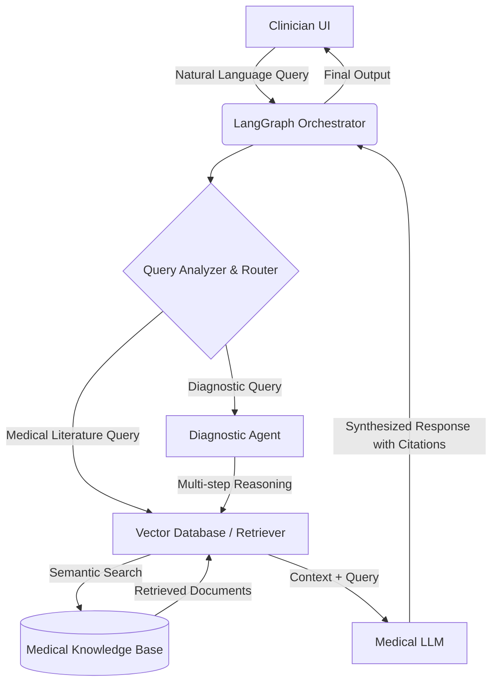

# Project Blueprint: Healthcare Knowledge Navigator for Clinicians

## 1. Executive Summary

The **Healthcare Knowledge Navigator** is a specialized, HIPAA-compliant Retrieval-Augmented Generation (RAG) system designed to assist clinicians in navigating vast amounts of medical literature, clinical guidelines, and anonymized patient data. By leveraging advanced Large Language Models (LLMs) and vector databases, the system allows healthcare professionals to query complex medical information using natural language. The primary goal is to provide rapid, evidence-based insights to support clinical decision-making, differential diagnosis, and continuous medical education, while strictly adhering to data privacy regulations.

This document serves as a comprehensive blueprint for developing the project from scratch, detailing the architecture, technology stack, workflows, and deployment strategy.

## 2. Project Scope and Objectives

### 2.1. Core Objectives
*   **Rapid Information Retrieval**: Enable clinicians to query medical knowledge bases (PubMed, clinical guidelines, drug databases) using natural language.
*   **Evidence-Based Summarization**: Synthesize complex medical texts into concise, actionable summaries with mandatory citations to source documents.
*   **Diagnostic Assistance**: Provide a LangGraph-powered agent to assist in differential diagnosis based on patient symptoms and retrieved medical literature.
*   **HIPAA Compliance**: Ensure all data handling, storage, and processing adhere to strict healthcare privacy regulations.

### 2.2. Out of Scope (Phase 1)
*   Direct integration with live Electronic Health Record (EHR) systems for real-time patient data updates (to minimize initial compliance risks).
*   Automated prescription generation or direct patient treatment execution.

## 3. System Architecture

The architecture follows a "Policy-Grounded RAG" pattern [1], ensuring that the LLM only generates responses based on retrieved, authoritative medical documents, thereby minimizing hallucinations.

### 3.1. High-Level Components

1.  **User Interface (UI)**: A secure web application for clinicians to input queries and view results.
2.  **Orchestration Layer**: LangChain and LangGraph manage the flow of data between the UI, the retriever, and the LLM.
3.  **Retrieval System**: A vector database storing embeddings of medical literature, coupled with a semantic search engine.
4.  **Generation Engine**: A specialized medical LLM (or a highly capable general LLM with strict prompting) that synthesizes the retrieved context.
5.  **Knowledge Base**: The underlying data sources (medical journals, guidelines, drug databases).

### 3.2. Architecture Diagram (Conceptual)

## 4. Technology Stack

### 4.1. Frontend / User Interface
*   **Framework**: Streamlit (Python) or Next.js (React) for a more robust, scalable web application.
*   **Authentication**: OAuth 2.0 / OpenID Connect (e.g., Auth0, Okta) with Multi-Factor Authentication (MFA) to ensure only authorized clinicians have access.

### 4.2. Backend & Orchestration
*   **Language**: Python 3.10+
*   **Framework**: FastAPI (for creating robust API endpoints if using Next.js frontend).
*   **Orchestration**: LangChain (for RAG pipelines) and LangGraph (for complex, stateful agent workflows like the diagnostic assistant).

### 4.3. AI Models & Embeddings
*   **Large Language Model (LLM)**:
    *   *Option A (Cloud/API)*: Anthropic Claude 3.5 Sonnet or GPT-4o (requires Business Associate Agreements - BAAs for HIPAA compliance). Claude models have shown strong performance in clinical decision support workflows [2].
    *   *Option B (Local/Open Source)*: Llama 3 (70B) or specialized medical models like MedLM or BioMistral, hosted on secure, private infrastructure to guarantee data privacy.
*   **Embedding Model**: BAA-covered OpenAI `text-embedding-3-large` or open-source alternatives like `BAAI/bge-large-en-v1.5` (hosted locally).

### 4.4. Data Storage & Retrieval
*   **Vector Database**: Pinecone (Enterprise tier with HIPAA compliance), Milvus, or a self-hosted solution like Qdrant or pgvector (PostgreSQL extension) for maximum control over data residency.
*   **Document Storage**: AWS S3 (encrypted at rest and in transit) for storing raw PDF guidelines and medical texts.

## 5. Data Workflows

### 5.1. Data Ingestion Pipeline (Offline)
1.  **Source Collection**: Gather medical guidelines (PDFs), PubMed abstracts (via API), and drug interaction databases (CSV/JSON).
2.  **Document Parsing**: Use tools like `Unstructured` or `PyPDF2` to extract text from documents.
3.  **Chunking**: Split text into manageable chunks (e.g., 500-1000 tokens) using LangChain's `RecursiveCharacterTextSplitter`, ensuring semantic boundaries are respected.
4.  **Embedding**: Convert text chunks into vector embeddings using the chosen embedding model.
5.  **Indexing**: Store embeddings and metadata (source URL, document title, publication date) in the Vector Database.

### 5.2. Query & Retrieval Pipeline (Online)
1.  **User Input**: Clinician submits a query (e.g., "What are the latest guidelines for managing hypertension in patients with chronic kidney disease?").
2.  **Query Processing**: The orchestrator sanitizes the query and generates an embedding.
3.  **Semantic Search**: The Vector Database retrieves the top *k* most relevant document chunks based on cosine similarity.
4.  **Prompt Construction**: The orchestrator constructs a prompt containing the user query and the retrieved context. *Crucial Step*: The prompt must explicitly instruct the LLM to answer *only* based on the provided context and to cite its sources.
5.  **Generation**: The LLM generates the response.
6.  **Output Delivery**: The response, along with links to the source documents, is displayed to the clinician.

### 5.3. Diagnostic Assistant Workflow (LangGraph)
1.  **State Initialization**: LangGraph initializes a state object containing patient symptoms (anonymized).
2.  **Information Gathering Node**: The agent queries the Vector Database for conditions matching the symptoms.
3.  **Reasoning Node**: The LLM analyzes the retrieved conditions and formulates a list of differential diagnoses.
4.  **Refinement Node**: The agent may ask the clinician follow-up questions (e.g., "Does the patient have a history of X?") to narrow down the possibilities.
5.  **Final Output**: The agent presents the differential diagnoses, ranked by likelihood, with supporting evidence from the literature.

## 6. Security and Compliance (HIPAA)

Given the sensitive nature of healthcare data, **HIPAA compliance** is paramount. The system must be designed with security and privacy at its core [1, 3].

### 6.1. Data De-identification
*   **Patient Data**: Any patient-specific data used for RAG (e.g., anonymized patient records) must undergo rigorous de-identification processes to remove all 18 HIPAA identifiers (e.g., names, dates, geographic subdivisions, medical record numbers, etc.) before ingestion into the system. This ensures that the data cannot be linked back to individual patients.

### 6.2. Access Control
*   **Role-Based Access Control (RBAC)**: Implement granular RBAC to ensure clinicians only access information relevant to their roles and permissions.
*   **Authentication**: Strong authentication mechanisms (MFA) for all users.

### 6.3. Data Encryption
*   **Encryption at Rest**: All data stored in databases (vector, relational) and object storage (S3) must be encrypted using industry-standard encryption (e.g., AES-256).
*   **Encryption in Transit**: All communication between system components and with the user interface must be encrypted using TLS 1.2 or higher.

### 6.4. Audit Trails and Logging
*   **Comprehensive Logging**: Implement detailed logging of all system activities, including user queries, data access, and LLM interactions. Logs must be immutable and regularly reviewed.
*   **Audit Trails**: Maintain audit trails to track who accessed what information, when, and for what purpose, crucial for compliance reporting.

### 6.5. Secure Infrastructure
*   **Cloud Provider**: Utilize a cloud provider (e.g., AWS, Azure, GCP) that offers HIPAA-eligible services and sign a Business Associate Agreement (BAA).
*   **Network Security**: Implement virtual private clouds (VPCs), security groups, and network access control lists (ACLs) to restrict network access.
*   **Vulnerability Management**: Regular security audits, penetration testing, and vulnerability scanning.

## 7. Deployment Strategy

### 7.1. Environment Setup
*   **Development Environment**: Local development setup with Docker for containerization to ensure consistency.
*   **Staging Environment**: A replica of the production environment for testing and quality assurance.
*   **Production Environment**: Cloud-based deployment (e.g., AWS, Azure, GCP) leveraging managed services for scalability, reliability, and security.

### 7.2. Containerization
*   **Docker**: Containerize the frontend, backend, and LangGraph agent components for portability and consistent deployment.

### 7.3. Orchestration
*   **Kubernetes (K8s)**: Deploy and manage containerized applications using Kubernetes for scalability, high availability, and automated deployments.

### 7.4. CI/CD Pipeline
*   **GitHub Actions / GitLab CI / Jenkins**: Implement a Continuous Integration/Continuous Deployment (CI/CD) pipeline for automated testing, building, and deployment of code changes.

### 7.5. Monitoring and Alerting
*   **Observability Tools**: Integrate monitoring tools (e.g., Prometheus, Grafana, Datadog) to track system performance, resource utilization, and potential issues.
*   **Alerting**: Set up alerts for critical system failures, security incidents, or performance degradation.

## 8. Future Enhancements (Beyond Phase 1)

*   **Integration with EMR/EHR Systems**: Secure, read-only integration with Electronic Medical Records (EMR) or Electronic Health Records (EHR) systems (with appropriate patient consent and robust security measures) to provide patient-specific context for RAG queries.
*   **Proactive Alerts**: Develop a system to proactively alert clinicians about new relevant research, drug interactions, or changes in guidelines based on their patient panel or areas of interest.
*   **Multimodal RAG**: Incorporate medical imaging data (e.g., X-rays, MRIs) into the RAG system, allowing clinicians to query visual data alongside text.
*   **Personalized Learning Modules**: Based on clinician queries and knowledge gaps, generate personalized learning modules for continuous professional development.

## 9. Conclusion

The Healthcare Knowledge Navigator for Clinicians represents a significant step towards empowering healthcare professionals with intelligent, evidence-based decision support. By meticulously designing a HIPAA-compliant RAG system powered by LLMs, LangChain, and LangGraph, this project aims to streamline information retrieval, enhance diagnostic accuracy, and foster continuous learning within the medical community. This blueprint provides a solid foundation for its development and deployment, ensuring a robust, secure, and impactful solution.

## 10. References

[1] Genzeon. (2026, February 5). *Policy-Enforced RAG for HIPAA-Compliant Healthcare AI*. [https://www.genzeon.com/the-power-of-policy-grounded-rag-in-healthcare-ai/](https://www.genzeon.com/the-power-of-policy-grounded-rag-in-healthcare-ai/)
[2] Gaber, F., Shaik, M., Allega, F., Bilecz, A. J., Busch, F., Goon, K., Franke, V., & Akalin, A. (2025, May 9). *Evaluating large language model workflows in clinical decision support for triage and referral and diagnosis*. npj Digital Medicine, 8(1), 263. [https://www.nature.com/articles/s41746-025-01684-1](https://www.nature.com/articles/s41746-025-01684-1)
[3] AWS. *Use case: Building a medical intelligence application with augmented patient data*. [https://docs.aws.amazon.com/prescriptive-guidance/latest/rag-healthcare-use-cases/case-1.html](https://docs.aws.amazon.com/prescriptive-guidance/latest/rag-healthcare-use-cases/case-1.html)
[4] Kohandel Gargari, O., & Habibi, G. (2025, April 21). *Enhancing medical AI with retrieval-augmented generation: A mini narrative review*. Digit Health, 11, 20552076251337177. [https://pmc.ncbi.nlm.nih.gov/articles/PMC12059965/](https://pmc.ncbi.nlm.nih.gov/articles/PMC12059965/)
