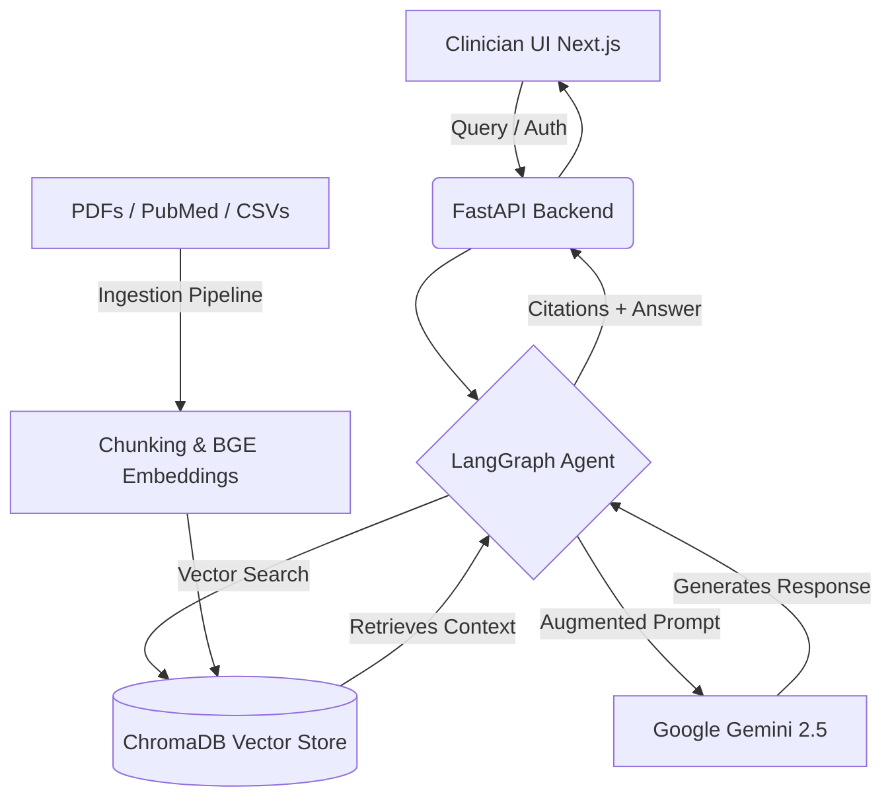

<div align="center">
  <h1>🏥 MedNavigator-AI</h1>
  <p><strong>A HIPAA-compliant Retrieval-Augmented Generation (RAG) system for Clinicians</strong></p>

  <p>
    <a href="https://github.com/shubham333k/Healthcare/commits/main"></a>
    <a href="https://reactjs.org/"></a>
    <a href="https://fastapi.tiangolo.com/"></a>
    <a href="https://deepmind.google/technologies/gemini/"></a>
    <a href="https://www.docker.com/"></a>
  </p>
</div>

---

## 🌟 Overview

**MedNavigator-AI** is a powerful, state-of-the-art AI assistant tailored explicitly for the medical domain. By leveraging a **Retrieval-Augmented Generation (RAG)** architecture, it grounds its responses in evidence-based medical literature, clinical guidelines, and approved drug databases, dramatically reducing hallucinations and providing reliable answers to complex clinical questions.

Designed with strict **HIPAA-compliance** in mind, MedNavigator-AI empowers clinicians, researchers, and medical professionals to safely query vast amounts of medical knowledge using natural language, all while ensuring Patient Health Information (PHI) remains secure and de-identified.

---

## ✨ Key Features

- **🔍 Natural Language Medical Queries**
  Ask intricate, multi-faceted medical questions and receive concise, evidence-based responses.
  
- **🧠 LangGraph-Powered Diagnostic Assistant**
  An interactive, agentic workflow capable of conducting differential diagnoses based on patient symptoms and history.

- **📚 Dynamic Medical Knowledge Base**
  Easily ingest unstructured and semi-structured data:
  - **PubMed Abstracts**
  - **Clinical Guidelines (PDFs)**
  - **Drug Databases & CSVs**
  
- **🔒 Enterprise-Grade Security & HIPAA Compliance**
  - **PHI De-identification:** Automatically scrub sensitive patient data before processing.
  - **Role-Based Access Control (RBAC):** Granular permissions using secure JWT tokens.
  - **Audit Logging:** Track all queries and system access for compliance.
  - **Data Encryption:** End-to-end encryption for data in transit and at rest.

- **📊 Strict Citation Tracking**
  Every claim made by the AI is backed by exact citations pointing to the ingested source documents, ensuring transparency and trust.

---

## 🏗️ Architecture & Tech Stack

MedNavigator-AI is built using modern, scalable technologies to ensure high performance and reliability.

| Component | Technology Used |
|-----------|----------------|
| **Frontend UI** | Next.js 14, React, TypeScript, Tailwind CSS |
| **Backend API** | FastAPI, Python 3.11+, Pydantic |
| **AI Orchestration**| LangChain, LangGraph |
| **LLM Engine** | Google Gemini 2.5 Flash |
| **Embeddings** | `BAAI/bge-large-en-v1.5` (Local Execution) |
| **Vector Database** | ChromaDB |
| **Authentication** | JWT, RBAC Middleware |
| **Containerization**| Docker, Docker Compose |

### 🔄 System Workflow


---

## 🚀 Quick Start Guide

Get MedNavigator-AI running locally on your machine in just a few steps.

### Prerequisites
- [Docker](https://www.docker.com/get-started) and Docker Compose
- A Google [Gemini API Key](https://aistudio.google.com/)

### 1. Clone the Repository
```bash
git clone https://github.com/shubham333k/Healthcare.git
cd Healthcare
```

### 2. Configure Environment Variables
Copy the example environment file and add your sensitive credentials:
```bash
cp .env.example .env
```
Open `.env` and add your **Gemini API Key** and other desired configurations.

### 3. Launch with Docker Compose
Build and spin up the entire stack seamlessly:
```bash
docker-compose up --build
```

### 4. Access the Application
Once the containers are running, access the various services:
- 🌐 **Frontend UI:** [http://localhost:3000](http://localhost:3000)
- ⚙️ **Backend API:** [http://localhost:8000](http://localhost:8000)
- 📖 **Interactive API Docs (Swagger):** [http://localhost:8000/docs](http://localhost:8000/docs)

**Default Admin Credentials:**
> **Email:** `admin@healthcare.nav`  
> **Password:** `admin123`

---

## 💻 Local Development Setup

If you prefer to run the components without Docker, follow these instructions.

### Backend Setup
```bash
cd backend
python -m venv venv

# Activate Virtual Environment
venv\Scripts\activate      # For Windows
# source venv/bin/activate # For macOS/Linux

pip install -r requirements.txt
uvicorn app.main:app --reload --port 8000
```

### Frontend Setup
```bash
cd frontend
npm install
npm run dev
```

---

## 📂 Project Structure

```text
MedNavigator-AI/
├── frontend/                # Next.js React application (UI)
├── backend/                 # FastAPI server & AI logic
│   ├── app/
│   │   ├── api/             # API routes, Auth, & Middleware
│   │   ├── core/            # AI pipelines (Embeddings, LLMs)
│   │   ├── rag/             # RAG chain logic & document retrievers
│   │   ├── agents/          # LangGraph diagnostic workflow agents
│   │   ├── ingestion/       # Document parsing and chunking
│   │   ├── security/        # PHI scrubbers, Encryption, RBAC
│   │   └── models/          # Database schemas & Pydantic models
│   └── data/                # Sample medical datasets
├── docker-compose.yml       # Multi-container orchestration
└── .github/workflows/       # CI/CD pipelines
```

---

## 🛡️ License & Disclaimer

**Disclaimer:** MedNavigator-AI is designed strictly for **educational and demonstration purposes**. It is not intended to replace professional medical advice, diagnosis, or treatment. Always consult a qualified healthcare provider for medical decisions.

This project is licensed under the MIT License.
